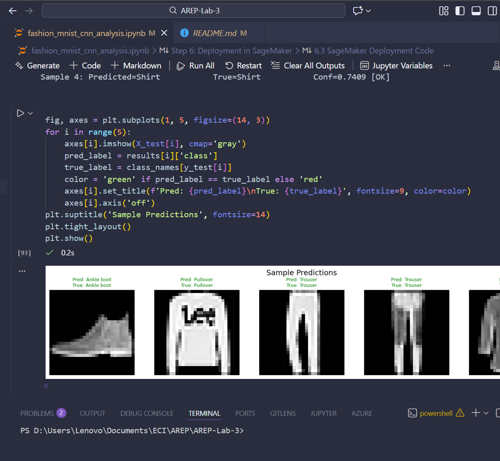
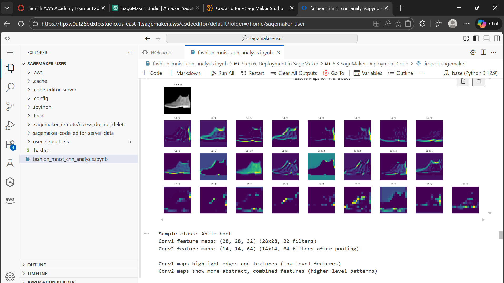

# Exploring Convolutional Layers: Fashion-MNIST

Exploring how convolutional architectural decisions affect learning compared to fully-connected networks.

## Overview

This project investigates convolutional neural networks (CNNs) for image classification using the Fashion-MNIST dataset. It compares a fully-connected baseline against a custom CNN architecture, runs controlled experiments varying kernel size, and provides interpretation of why convolutions work for image data.

**Course:** AREP - Machine Learning Bootcamp
**Author:** David Felipe Velasquez Contreras

## Repository Structure

```
/
├── README.md
├── fashion_mnist_cnn_analysis.ipynb   # Main analysis notebook (Steps 1-6)
├── saved_model/                        # Exported CNN model + metadata
├── screenshots/                        # Execution evidence
└── NeuralNetworksPackage/              # Reference notebooks
    ├── mnist_complete_explained.ipynb
    └── neural_network_complete_workshop.ipynb
```

## Dataset Description

**Source:** [Fashion-MNIST](https://github.com/zalandoresearch/fashion-mnist) (TensorFlow/Keras built-in)

| Property | Value |
|----------|-------|
| Training Samples | 60,000 |
| Test Samples | 10,000 |
| Image Size | 28x28 grayscale |
| Classes | 10 |
| Balance | Uniform (6,000/class train, 1,000/class test) |

### Classes

T-shirt/top, Trouser, Pullover, Dress, Coat, Sandal, Shirt, Sneaker, Bag, Ankle boot

**Why Fashion-MNIST?** Images contain spatial structure (edges, textures, shapes) that convolutional layers can exploit. Similar silhouettes across upper-body categories (Shirt vs T-shirt vs Pullover) make this harder than MNIST digits, providing a meaningful test for CNN vs Dense architectures.

## Implementation Details

### Step 1: Dataset Exploration (EDA)
- Load and inspect dataset dimensions, types, pixel ranges
- Class distribution analysis (balanced across all 10 classes)
- Sample visualization per class + average images
- Pixel value distribution analysis
- Preprocessing: [0,255] → [0,1] normalization + one-hot encoding

### Step 2: Baseline Model (Non-Convolutional)
- Architecture: Flatten → Dense(256, ReLU) → Dense(128, ReLU) → Dense(10, Softmax)
- ~235K parameters
- Training: 10 epochs, batch size 128, 15% validation split
- Per-class accuracy analysis and confusion matrix
- Identified limitations: spatial structure loss, confusion between similar garments

### Step 3: Convolutional Architecture Design
- Architecture: Conv2D(32, 3x3) → MaxPool → Conv2D(64, 3x3) → MaxPool → Dense(128) → Dense(10)
- Design choices justified: 3x3 kernels, same padding, progressive filter increase, MaxPooling
- Side-by-side comparison with baseline (accuracy, loss, per-class performance)
- Confusion matrix comparison

### Step 4: Controlled Experiments (Kernel Size)
- Systematically varied kernel size: 3x3, 5x5, 7x7
- All other hyperparameters kept fixed (controlled experiment)
- Quantitative comparison: accuracy, loss, parameter count
- Per-class analysis and trade-off discussion
- Conclusion: smaller kernels preserve fine detail better for 28x28 images

### Step 5: Interpretation and Architectural Reasoning
- Why CNNs outperform Dense: spatial locality + weight sharing
- Inductive bias of convolution: locality, translation equivariance, hierarchical composition
- When convolution is NOT appropriate: tabular data, permutation-invariant inputs, non-spatial data
- Bonus: visualization of learned filters and feature maps

### Step 6: SageMaker Deployment
- Model exported to `saved_model/fashion_mnist_cnn.keras` with metadata JSON
- Local inference function with sample predictions
- SageMaker deployment code (commented, ready to uncomment in SageMaker)

## Architecture Diagrams

### Baseline (Dense)
```
Input (28x28) → Flatten (784) → Dense(256) → Dense(128) → Dense(10)
```

### CNN
```
Input (28x28x1) → Conv2D(32, 3x3) → MaxPool(2x2)
               → Conv2D(64, 3x3) → MaxPool(2x2)
               → Flatten (3136) → Dense(128) → Dense(10)
```

### Kernel Size Experiment
```
Same architecture as CNN, but kernel sizes varied: 3x3, 5x5, 7x7
All other hyperparameters fixed for controlled comparison
```

## Libraries Used

- **TensorFlow/Keras:** Model building and training
- **NumPy:** Numerical operations
- **Matplotlib:** Visualization

## Local Execution Evidence





## AWS SageMaker Execution Evidence



---

## Progress

- [x] Step 1: Dataset Exploration (EDA)
- [x] Step 2: Baseline Model (Non-Convolutional)
- [x] Step 3: Convolutional Architecture Design
- [x] Step 4: Controlled Experiments (Kernel Size)
- [x] Step 5: Interpretation and Architectural Reasoning
- [x] Step 6: SageMaker Deployment 
